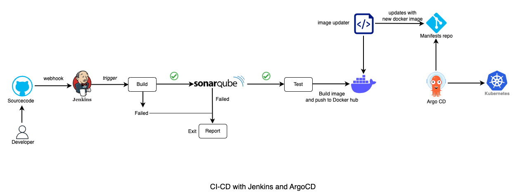

# End to End DevOps CI using Jenkins and CD using ArgoCD

**Tools used :** _VS Code, Git/GitHub, Jenkins, AWS EC2, Shell (Unix), Python, Docker, SonarQube, K8s, ArgoCD_

## Architecture (high level)


## Pre-requisites
1. Install and configure Jenkins server on **AWS EC2** instance (use t2.medium and terminate to avoid any recurring charges) - Done
### 
``` -- Update packages
sudo apt update -y
sudo apt upgrade -y

--Install Java
sudo apt install openjdk-11-jre

--Install Jenkins
curl -fsSL https://pkg.jenkins.io/debian/jenkins.io-2023.key | sudo tee \
  /usr/share/keyrings/jenkins-keyring.asc > /dev/null
echo deb [signed-by=/usr/share/keyrings/jenkins-keyring.asc] \
  https://pkg.jenkins.io/debian binary/ | sudo tee \
  /etc/apt/sources.list.d/jenkins.list > /dev/null

sudo apt-get update

sudo apt-get install jenkins
```
2. Install and configure **SonarQube** on the EC2 Jenkins Server - Done

####
``` sudo apt install unzip
sudo adduser sonarqube    -- hint : password is sonarqube
sudo su - sonarqube

wget https://binaries.sonarsource.com/Distribution/sonarqube/sonarqube-9.4.0.54424.zip

unzip *

chmod -R 755 /home/sonarqube/sonarqube-9.4.0.54424
chown -R sonarqube:sonarqube /home/sonarqube/sonarqube-9.4.0.54424

cd sonarqube-9.4.0.54424/bin/linux-x86-64/
./sonar.sh start
```
3. Install and configure **Docker** on the EC2 Jenkins Server - Done

###
Run the below command to Install Docker
```
sudo su -
sudo apt update
sudo apt install docker.io

--- Grant Jenkins user and Ubuntu user permission to docker deamon
usermod -aG docker jenkins
usermod -aG docker ubuntu
systemctl restart docker
```
Once you are done with the above steps, it is better to restart Jenkins.

http://<ec2-instance-public-ip>:8080/restart
The docker agent configuration is now successful.

4. Setup a **minikube** Kubernetes cluster on AWS EC2 instance (use t2.medium)

* TODO: Use userdata for setting up the jenkins, sonarqube and docker in the AWS Ec2 instance for reuse
* TODO: Add scripts


## CI-CD Setup
1. Create a git repository for the project (this git repo will be reference in the next step)
2. Create a **Jenkins CI** pipline (using Groovy script)
3. Configure **Jenkins Runner**
4. Trigger Jenkins job using VS Code
5. Configure **Webhook** in Jenkins
6. Create and build a Python application (can be any application)
  * TODO : Add test framework for python and incorporate in the CI pipeline for automated test
7. Dockerize python applicaiton and push to Dockerhub
8. Create Kubernetes manifest file (service yaml)
9. Create a ArgoCD CD pipleine and configure git to fetch the K8s manifest
10. Connect Kubernetes node to ArgoCD
11. Trigger CD Jenkins job using CURL command and pass the variables from CI pipeline